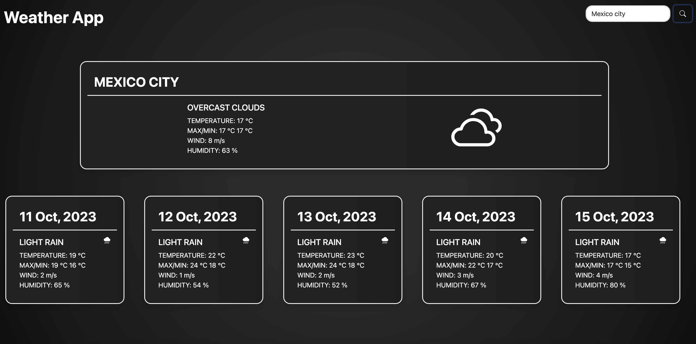

# Weather App

The Weather App is a web application that displays weather information based on user input. It uses an API to fetch weather data and updates the user interface dynamically.

## Features
```
Input: Users can enter a location to get the weather information for that location.
Weather Data: The application fetches weather data from an API and displays it on the page.
Display: The application displays the current weather condition, temperature, wind speed, humidity, and other relevant information.
Icons: The application uses custom icons to represent different types of weather conditions.
Responsive Design: The application is designed to work well on different screen sizes and devices.
```

## Technologies Used

```
HTML: The structure and layout of the application is built using HTML.
SASS: SASS, a CSS preprocessor, was implemented to create a unique design while leveraging the efficiency of Bootstrap. It provides powerful features such as mixins, variables, and nesting.
Bootstrap: Bootstrap is a popular CSS framework used for responsive design and styling. The SASS files of Bootstrap were customized to match the design requirements of the application.
JavaScript: The functionality of the application is implemented using JavaScript.
API: The application uses the OpenWeatherMap API to fetch weather data. Credits to OpenWeatherMap for providing the weather data.
API: The application uses the Ninja API to fetch cities data. Credits to Ninja API for providing the cities data.
dotenv: The dotenv package allowed for secure storage and access to sensitive information such as API keys.
webpack: The webpack module bundler is used to bundle the JavaScript and SASS files of the application. It simplifies the build process and allows for code optimization.
webpack-dev-server: The webpack-dev-server is used for development purposes. It provides a local development server that automatically refreshes the page whenever changes are made to the source code.
```

## Deployed App

https://andatax.github.io/Weather-App/

## Repository

https://github.com/Andatax/Weather-App

## Screenshot of the deployed app


    
